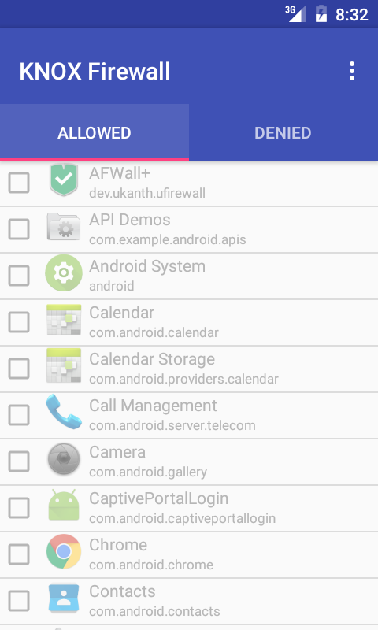

# knox-firewall
Restrict mobile data on Samsung devices

The Android firewall app creates deny rules on Samsung devices using the [Knox Standard SDK](https://seap.samsung.com/sdk/knox-standard-android). A valid enterprise license key is required, which can be obtained for free [here](https://seap.samsung.com/license-keys).

